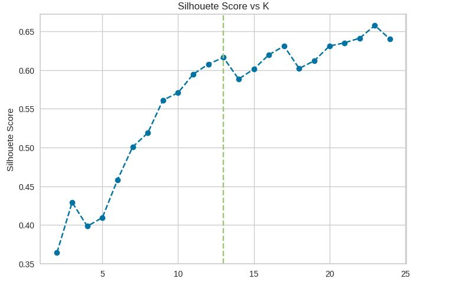
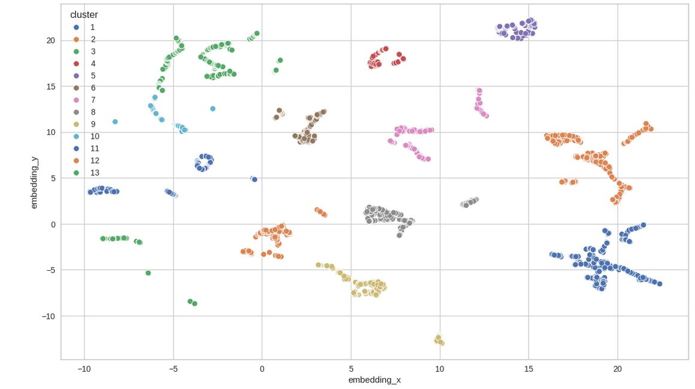
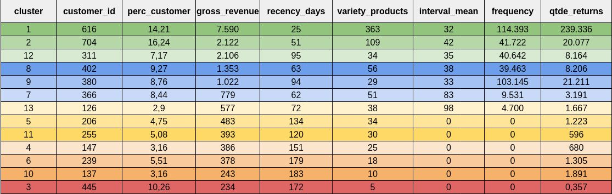

Olá, seja bem-vindo(a)!

Este projeto, seguirar uma metodologia diferente dos demais anteriores, será feito iniciamente baseado em um projeto de outro aluno(a), como o propósito é gera conhecimento e não ofender ou denegrir a imagem deste, não será informado o autor do trabalho original. Por fim, Encontra-se no meu respositório cinco notebooks. Ṕrimeiro, o original intitulado como notebook_reference.ipynb. Segundo, o comentado, intitulado como pa05-end.ipynb que segue o trabalho do autor, mas umas reflexões quando descordar do caminho tomado ou desenvolvido do código por minha parte. Terceiro e quarto são notebooks com o código do deploy do projeto, tendo sido intitulados como pa05-deploy_local e pa05-deploy_local. Por último, o notebook Planejamento.ipynb, neste, está as observações gerada durante as aulas do curso da comunidade DS.  

## 1. Problema de negócios
### 1.1 Problema
O time de negócio da empresa fez uma reunião e gostaria de entender melhor quem são os clientes da empresa para tomar iniciativas mais eficazes em marketing e promoção etc.
 
### 1.2 Motivação
A empreresa está querendo realizar uma promoção personalizada para cada grupo de clientes.

### 1.3 Demandas de negócio

Produto de dados solicitado:
* Uma clusterização com descrição das características dos melhores clientes.

## 2. Premissas de negócio

- O planejamento da solução será validado com os times de negócio, visando garantir que as soluções desenvolvidas sejam úteis na sua tomada de decisão.

#### As variáveis do dataset original são:

Variável | Definição
------------ | -------------
|invoice_no:|    		Número da fatura (um número integral de 6 dígitos atribuído exclusivamente a cada transação)|
|stock_code:|    		Código do produto (item)|
|description:|  		Product (item) name|
|quantity:|     		As quantidades de cada produto (item) por transação|
|invoice_date:|  		O dia em que cada transação foi gerada|
|unit_price:|    		Preço unitário (Preço do produto por unidade)|
|customer_id:|   		Número do cliente (ID exclusivo atribuído a cada cliente)|
|country:|      		Nome do país (O nome do país onde cada cliente reside)|

#### As variáveis do dataset criadas são:

Variável | Definição
------------ | -------------
|gross_revenue:|  	O total que o cliente gastou em um pedido. |
|returned: |			Informa se pedido retornou ou foi cancelado.|
|recency_days:|		A quantidade de dias que o cliente fez sua última compra em relação ao último dia do dataset ou data máxima.|
|quantity_purchased: |Quantidade de vezes que o cliente comprou.|
|total_items:    |   	Total de items comprado pelo cliente no período do dataset.|
|variety_products:|	Variedade de produtos comprado pelo cliente.|
|avg_per_purchase: |	Quantidade média gasta pelo cliente por pedido|
|interval_mean     |  A média dos intervalos de compra do cliente.|
|interval_std     |   O desvio padrão da média dos intervalos de compra do cliente.|
|n_buy		|		Número de vezes que o cliente comprou.|
|avg_basket_size: |	Média de itens por cesta|
|avg_product_basket:| Média de variadade de produtos por cesta.|

## 3. Planejamento da solução

### 3.1. Produto final

O que será entregue efetivamente?
- Uma planilha com características dos clientes.
- Insight sobre o negócio.
- Divisão dos clientes em segmentos. 

 ### 3.2. Ferramentas

Quais ferramentas serão usadas no processo?
- Pyenv;
- Jupyter Notebook;
- Git, Github;
- Python;
- Google Sheets;
- Sistema Linux.

## 4. Os 3 principais insights dos clientes

#### 1 Qual o período do ano que mais vende ?

* 1. Novembro 
* 2. Outubro 
* 3. Setembro.

* Insight de negócio: Como se trata de um ecommerce de produtos voltados para presentes, existe um aumento significativo de vendas nós meses de Setembro até a Novembro. O que pode ser explicado no que se refere aos meses próximo do natal e festividades. Contudo, nota se compras em atacado, o que remete a presença de revendendores, principalmente para o mês de outubro.  A empresa pode abraça dando promoção a esses atacandistas ou limitar a quantidade de compra para aqueles produtos que tem uma previsão alta de vendas entre os dois últimos meses do ano, e buscar fazer elas mesmo a venda neste mercado.

#### 2 Qual o período do ano que menos vende ?

* 1. Dezembro 
* 2. Fevereiro  
* 3. Abril

#### 3 Qual país é do cliente que mais compra ?

* United Kingdom, o que era de espera já que maior parte das vendas é para United Kingdom.

* Insight de negócio: É necessário uma pesquisa para saber o motivo das vendas está concentrado mais em United Kingdom.

## 5. Resultados para o negócio

### 5.1 Resultados do cluster

### 5.2 Mapa dos cluster encontrado

De acordo com os critérios definidos, foi segmentado os clientes em 13 grupos, embora não seja o melhor resultado como mostra a imagem da seção 5.1, mas apresenta um bom resultado. O motivo da escolha de 13 clusters em vez do melhor resultado é facilidade para trabalhar com clientes em menos grupos

Como resultado para o negócio foram criados:

* Dataset ou conjunto de dados em sqlite.

* Resultados no excel, caraterizando os principais clientes.

* Insights sobre os negócio e principais clientes.

## 5. Conclusão

* O objetivo do projeto foi alcançado, dado que os produtos de dados propostos foram gerados com sucesso. O time de negócio irar utilizar para a tomada de decisão.

Planilha no google sheets [Planilha com resultados do perfil dos grupos](https://docs.google.com/spreadsheets/d/1sODujh6S8vNwnoUkBMuaOJWzYAolyqs-JhU4cWSq5oo/edit?usp=sharing).

Em relação ao tons de cores deve intepretar em relação o quanto este grupo dar lucro a empresa verde e azul são cores que quanto mais fortes mais dar lucro. já as demais cores quanto mais forte menos da lucro. Observação a tabela já está organizada neste sentido.

## 7. Próximos passos

Algumas melhorias no projeto podem ser incrementadas no futuro:

* Carregar um dados em um servidor
* Deploy do modelo
* Criar um botão com api do modelo de Machine Learning no google sheets para que resultado seja emitido nele com as médias de característica dos clientes.
* Deixar um dashbord no streamlit ou metabase com informações dos dados.

## 6 Referências
* Este Projeto foi feito como parte do curso "DS em Produção", da [Comunidade DS](https://www.comunidadedatascience.com/).
* O Dataset foi obtido no [UC irvine](https://archive.ics.uci.edu/dataset/502/online+retail+ii).

#### Observação: 
**Python 3.12.3**
